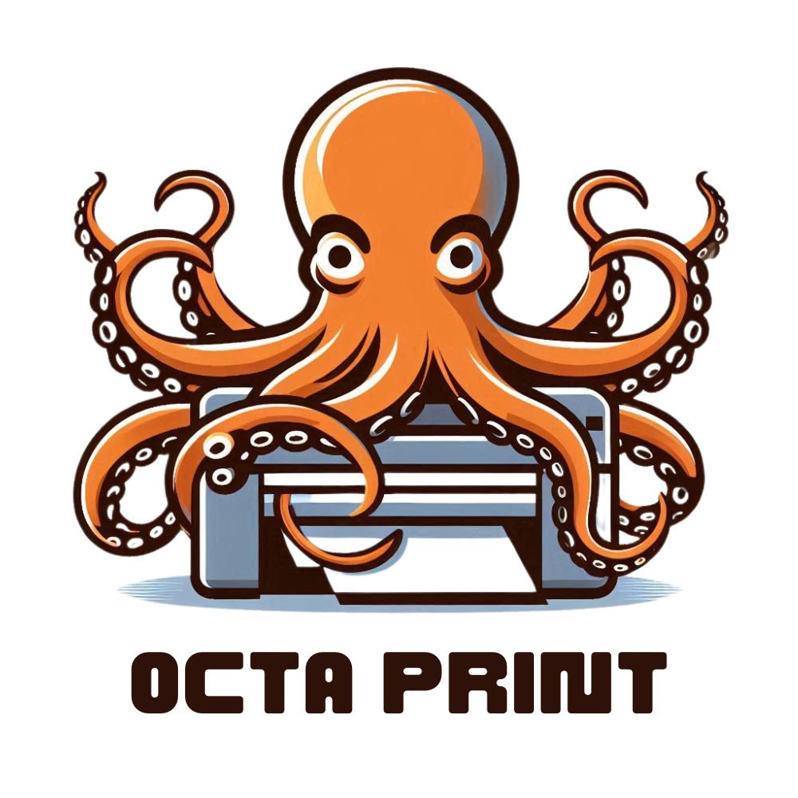

# Octa-Print


## Introduction

**Octa-Print** is a centralized system designed to manage multiple printers efficiently. It enables clients to upload files, select configurations, and request prints, which are then handled by the system and sent to the nearest printer for processing. This README provides an overview of the project structure, components, and setup instructions.


## Components
### Octa-Hub 
**Octa-Hub** serves as the central component of the system, providing a web interface for clients to interact with. 
Key features include:
- **Web Interface** : User-friendly website for file uploads and configuration selection.
- **Database** : Stores client information, uploaded files, configurations, and print request statuses.
- **Communication** : Handles communication with Octa-Arms (Printer Clients) to send print requests and receive status updates.
- **Security**: Implements authentication and authorization mechanisms for data privacy and system integrity.
### Octa-Arms 
**Octa-Arms** represent the printer clients in the system. 
Key features include:
- **Communication Interface** : Listens for print requests from Octa-Hub.
- **Printer Control** : Automatically prints files based on received requests and configurations.
- **Status Updates** : Sends status updates back to Octa-Hub to track printing progress.

## Installation 
```bash
pip install virtualenv # For installing Virtual Environment
python3 -m venv $PWD/Octa-Arm # Creating Virtual Environment
pip install -r Octa-Arm/requirements.txt # Installing Required Libraries
```


## License
This project idea was originally developed for the [WeAdvert](https://weadvert.lk/) Advertising Agency. Now the project is open-source and available under the [MIT License](./../License/LICENSE).


 